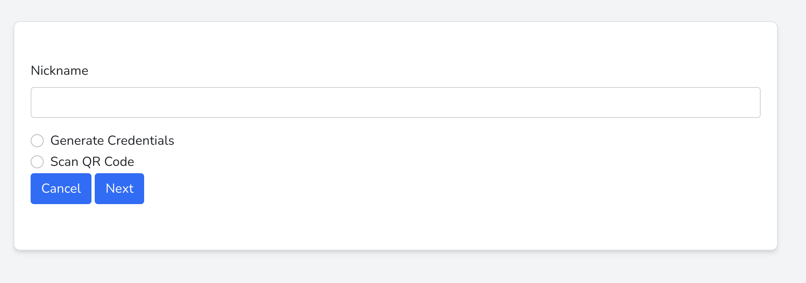
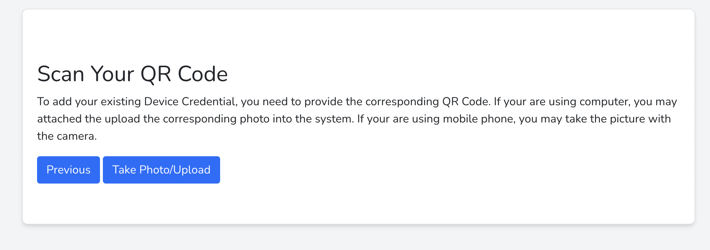
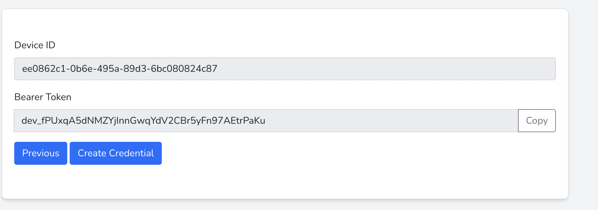
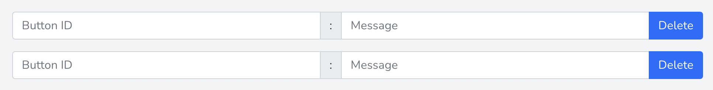
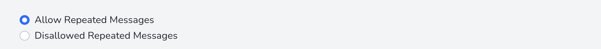
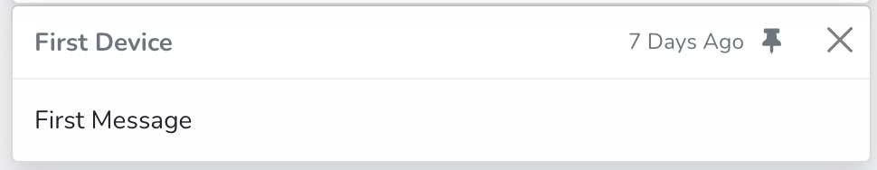

# Introduction
Specific Button on the Specific Device means the message.
When the user presses the specific button on the specific device, the request is sent to this Platform and the user 
may view the new message in the console.


# Console
## Device List

> Device List is a page for you to manage all devices effectively.

### New Device


There are 2 ways for you to add a new device. 

The first way is to scan 
the existing QR Code, which includes the Device Id(UUID Format) and 
Bearer Token in json format.

The data in the QR code must be in the following format.
```
{
    "device_id":"(UUID)",
    "bearer_token":"('dev_' + 40 character random string)"
}
```
The second way is to generate a new 
credentials immediately.


### Action On Device


You may perform 3 actions against a device, including Making Active, Suspend, and Revoke.

You may perform certain action against a device, you need to select the device.

To Revoke a device, you must first suspend it. This may ensure the user think twice before
doing it.

### Edit Device
#### Changing Nickname
You may change the nickname of the corresponding to whatever you want.

#### Button Id - Message

You may set different message for different Button Id.
The Button Id must be unique within this device. You may set whatever Button Id you want given that
it is unique.
#### Repeated Messages


### Ownership Share
You may share the device to another user of this console, to enable them to view, pin, or
delete messages. The sharee may also change the settings of the corresponding device. It depends 
on the sharee's right set by the sharer.

#### Right 
##### Basic
View messages received from the corresponding device.
##### Intermediate
View, Pin, and delete messages received from the corresponding device.
##### Advanced
View, Pin, and delete messages received from the corresponding device.
Change settings of the corresponding device.

#### Give Up Sharee's Right
The sharee may give up the right on the corresponding device

#### Revoke Sharee's Right
The sharer may revoke the sharee's right on the corresponding device.
### Reveal Bearer Token
The Bearer Token is protected through encryption. The user may decrypt it to read the
corresponding bearer token.


## Mobile Access
You may access messages from the pwa app.
### Access Token
In order to connect from the pwa app, you need to copy and paste the Access Token to the PWA app.
### Nickname
For each access token, you may specify whatever nickname you want.
## API Tokens

## Subscription


## Message


### Pin
Pin the message important to you.
### Delete
Delete the message by pressing the cross at the top-right corner.
### Filter
Sometimes there are many messages in the console. You might find it hard to manage. However,
there is a very good feature enables you to filter the messages by the Device Name, Pin Status(Pin or Unpinned),
and Origin(Message from your own device or Message from the Device Shared To You)

