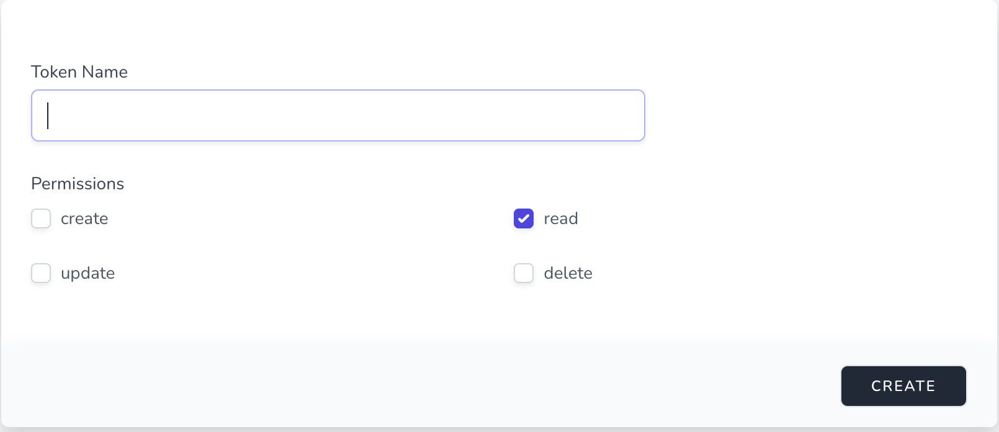

# API Tokens

You may use external applications to access the data. To do that,
you need an API Token to do so.

| Permissions      | Right                       |
| ---------------- | --------------------------- |
| Create           | Create Resources            |
| Read             | Read Existing Resources     |
| Update           | Update Existing Resources   |
| Delete           | Delete Existing Resources.  |

You may issue API Tokens in the Console. When you generate a new token,
you need to set the nickname, and set its right(Create, Read, Update, Delete).

To know how to use the API, please visit the API docs Page.

