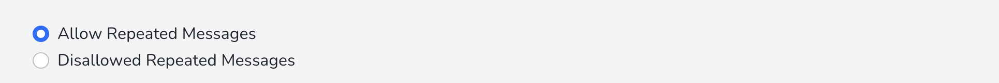

# Device List

> Device List is a page for you to manage all devices effectively.

## [New Device](#new-device)


There are 2 ways for you to add a new device. 

The first way is to scan 
the existing QR Code, which includes the Device Id(UUID Format) and 
Bearer Token in json format.

The data in the QR code must be in the following format.
```
{
    "device_id":"(UUID)",
    "bearer_token":"('dev_' + 40 character random string)"
}
```
The second way is to generate a new 
credential immediately.


## [Action On Device](#action-on-device)


You may perform 3 actions against a device, including Making Active, Suspend, and Revoke.

You may perform certain action against a device, you need to select the device.

To Revoke a device, you must first suspend it. This may ensure the user think twice before
doing it.


## [Edit Device](#edit-device)
### [Changing Nickname](#changing-nickname)
You may change the nickname of the corresponding to whatever you want.

### [Button Id - Message](#button-id---message)

You may set different message for different Button Id.
The Button Id must be unique within this device. You may set whatever Button Id you want given that
it is unique.
### [Repeated Messages](#repeated-messages)


The sender may press the same button from same device multiple times. Each time the sender 
presses the button, the message is generated. It means that you will see repeated messages
in the console/PWA App. 

You may disable that in the console. 

Once you disable that, there is no repeated messages. When there is no corresponding message and the sender try to press the button, the message is generated. After that, further press on the same button from the same device will
not be entertained. If that message is deleted in the console, the press on that button will lead to the regeneration
of the message.

## [Ownership Share](#ownership-share)
You may share the device to another user of this console, to enable them to view, pin, or
delete messages. The sharee may also change the settings of the corresponding device. It depends 
on the sharee's right set by the sharer.

### [Sharee's Right](#sharees-right)
| Right Classification       | Right                                                            |
| -------------------------- | ---------------------------------------------------------------- |
| Basic                      | View messages received.                                          |
| Intermediate               | View, Pin, and delete messages received.                         |
| Advanced                   | View, Pin, and delete messages received. Change device settings. |


### [Give Up Sharee's Right](#give-up-sharees-right)
The sharee may give up the right on the corresponding device

### [Revoke Sharee's Right](#revoke-sharees-right)
The sharer may revoke the sharee's right on the corresponding device.
## [Reveal Bearer Token](#reveal-bearer-token)
The Bearer Token is protected through encryption. The user may decrypt it to read the
corresponding bearer token.

