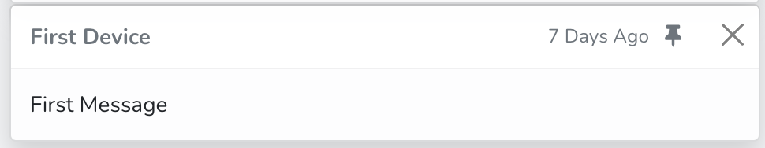

# Message

## [Pin](#message-pin)
Pin the message important to you.

>If you are the sharee and you only have the Basic right on the shared device , you cannot pin the message assocated to that device. 

## [Delete](#message-delete)
Delete the message by pressing the cross at the top-right corner.

>If you are the sharee and you only have the Basic right on the shared device , you cannot delete the message assocated to that device. 

## [Filter](#message-filter)
Sometimes there are many messages in the console. You might find it hard to manage. However,
there is a very good feature enables you to filter the messages by the Device Name, Pin Status(Pin or Unpinned),
and Origin(Message from your own device or Message from the Device Shared To You).

>Originally, the message associated to the device shared to you cannot be viewed in the console. To view that, you may press Origin Button and check "Message Shared To Me".